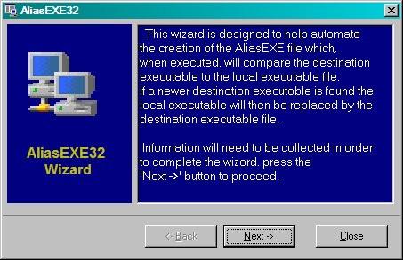



## AliasEXE32

### Description

AliasEXE32 is a program that allows users on a network to automatically get an updated EXE for a Visual Basic program whenever that program is modified.

Why This Program Was Written

The problem:

We were developing applications rapidly for a Y2K coversion from the legacy database to SQL Server. We needed a way to distribute these front-end applications to all of the users on the network. As the programs were modified and new EXEs were created, it was not practical to have the users run a setup program for each update.

The solution:

Basically the way the tool works is it creates an alias EXE based on the original .VBP project file. For example, your application EXE name is myapp.exe. This tool creates an EXE named myapp_run.exe. On the network you have created a directory called apps\bin where all of the program executables reside. In order for this to work all of the users must be mapped to the same common drive on the network. During distribution of the program you include the alias EXE file (myapp_run.exe) in the setup and the desktop icon and the program group link point to this file instead of the actual program EXE. When the user runs the program, it goes out to the specified network location and checks to see if there is a more recent version of the base EXE file. If one exists it copies the file from the network location to the home directory of the user and then executes the program and closes itself.

Obviously this was a quick fix and it worked great for a time, but later other methods were put into place. The reason I am submitting this code example is because it is an interesting little project using VB6 to actually create a VB project and then compile it into an EXE on the fly.

I don't know if there is another program of this type on PSC, but here it is. I hope this is useful to someone. It came in handy at the time it was needed and would probably be usable on any any small network today.
 
### More Info
 

             |
---                |---
**Submitted On**   |2005-02-05 18:22:44
**By**             |[KnowWare\-Soft](https://github.com/Planet-Source-Code/PSCIndex/blob/master/ByAuthor/knowware-soft.md)
**Level**          |Intermediate
**User Rating**    |4.5 (18 globes from 4 users)
**Compatibility**  |VB 5\.0, VB 6\.0
**Category**       |[Complete Applications](https://github.com/Planet-Source-Code/PSCIndex/blob/master/ByCategory/complete-applications__1-27.md)
**World**          |[Visual Basic](https://github.com/Planet-Source-Code/PSCIndex/blob/master/ByWorld/visual-basic.md)
**Archive File**   |[AliasEXE32184879252005\.zip](https://github.com/Planet-Source-Code/knowware-soft-aliasexe32__1-58718/archive/master.zip)

